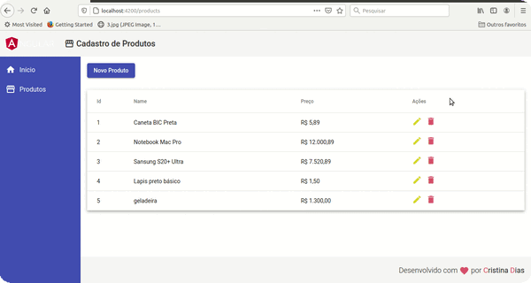

## Produtos

Aplicação simples em cadastro de produtos - crud em Angular

### Front-end

>Tela do front:

  

 

### Getting Started

>. Clone este repositório;
>. Abra seu terminal/prompt e navegue até o diretório do projeto que clonou;
>. Instalação local: **$ npm install**;
>. Rodar a aplicação: **npm start**.

#### Versão do Angular: 9

**Back-end:** banco de dados em json.